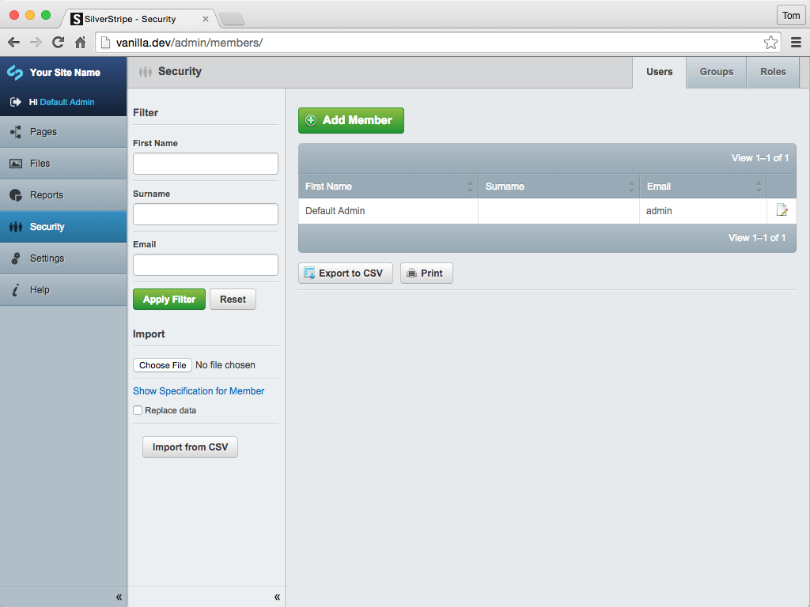

# Security Module

[![Latest Version on Packagist][ico-version]][link-packagist]
[![Software License][ico-license]](LICENSE.md)
[![Quality Score][ico-code-quality]][link-code-quality]
[![Total Downloads][ico-downloads]][link-downloads]

## Overview

Enhanced SilverStripe CMS security section for managing members, groups, and roles.



## Requirements

- SilverStripe CMS 3.1.15 and newer or 3.2 and newer.

## Install

### Via Composer

``` bash
$ composer require studiobonito/silverstripe-security
```

### Manually

Copy the 'silverstripe-security' folder to the root of your SilverStripe installation.

## Usage

The model provides a drop in replacement for the default 'Security' section in the SilverStripe CMS.
This 'Security' section replacement is based on `ModelAdmin`
and provides simple filtering which is good for managing sites with large numbers of users/groups.

## Roadmap

- [x] Create `ModelAdmin` base drop in for current security section.
- [ ] Add options for admins to control available fields for members.
- [ ] Extend filtering options
- [ ] Improve import/export

## Contributing

Please see [CONTRIBUTING](CONTRIBUTING.md) for details.

## Security

If you discover any security related issues, please email support@studiobonito.co.uk instead of using the issue tracker.

## Credits

- [Tom Densham][link-author]
- [All Contributors][link-contributors]

## License

The BSD-2-Clause License. Please see [License File](LICENSE.md) for more information.

[ico-version]: https://img.shields.io/packagist/v/studiobonito/silverstripe-security.svg?style=flat-square
[ico-license]: https://img.shields.io/badge/license-BSD-brightgreen.svg?style=flat-square
[ico-code-quality]: https://img.shields.io/scrutinizer/g/studiobonito/silverstripe-security.svg?style=flat-square
[ico-downloads]: https://img.shields.io/packagist/dt/studiobonito/silverstripe-security.svg?style=flat-square

[link-packagist]: https://packagist.org/packages/studiobonito/silverstripe-security
[link-code-quality]: https://scrutinizer-ci.com/g/studiobonito/silverstripe-security
[link-downloads]: https://packagist.org/packages/studiobonito/silverstripe-security
[link-author]: https://github.com/nedmas
[link-contributors]: ../../contributors